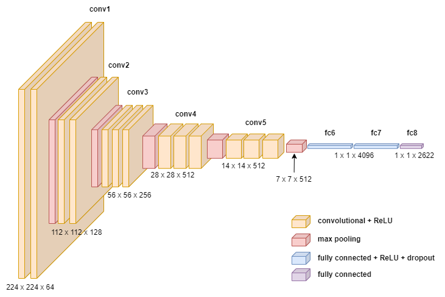

# Face Recognition
University coursework, a re-implementation of face recognition models in Matlab

<p align="center" float="left">
    
    
</p>
<p align="center" float="left">
        
</p>
<p align="center" float="left">
        
</p>

# Reproducibility
1. MATLAB Toolboxes
    - [deep learning toolbox](https://uk.mathworks.com/products/deep-learning.html)
    - [parallel computing toolbox](https://uk.mathworks.com/products/parallel-computing.html)
    - [Converter for TF Keras Model](https://uk.mathworks.com/matlabcentral/fileexchange/64649-deep-learning-toolbox-converter-for-tensorflow-models)

2. Model Params
    - [MATLAB VGGFace Params](https://github.com/teoshibin/COMP3007_CV_Face_Recognition/releases/latest) - place it under `Weights\VGGFace\` for it to work
g
# Dataset
- LFW funneled | [kaggle](https://www.kaggle.com/datasets/atulanandjha/lfwpeople) | [official](http://vis-www.cs.umass.edu/lfw/)
- a small subset of celeb dataset (100 subjects 1344 test images)

# Folder Structure
```
.
└── root/
    ├── Common/
    │   ├── DatabaseFunctions/
    │   ├── GeneralFunctions/
    │   ├── lfw-details/
    │   └── testLabel.mat
    ├── FaceDatabase/
    │   ├── lfw-funneled/
    │   ├── ...
    │   ├── Train/
    │   │   ├── example_subject_1/
    │   │   └── example_subject_2/
    │   └── Test/
    ├── Models/
    ├── Weights/
    ├── Screenshot/
    ├── Evaluation.m
    ├── EvaluationAll.m
    ├── GenerateROC.mlx
    └── README.md
```
`Common` includes all auxiliary functions for dataset manipulation and dlmodel functions   
`lfw-details` extracted text files from LFW Dataset   
`testLabel.mat` true label values for prepared train and test set   
`FaceDatabase` image dataset dump   
`Models` contain subfolders of essential model functions   
`Weights` contain subfolders of essential model pretrained parameters   
`Screenshot` screenshots   
`Evaluation.m` main script   
`EvaluationAll.m` extra main script   
`GenerateROC.mlx` ROC plot live script   

# License
Licensed under the [MIT License](./LICENSE.md).
